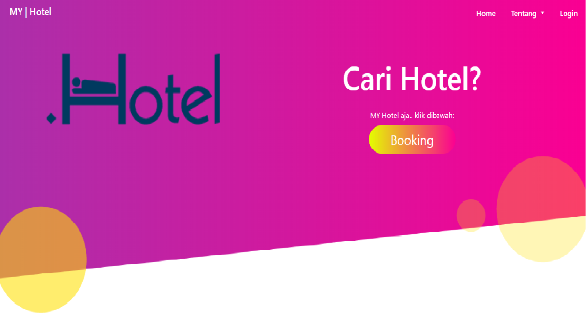

<!DOCTYPE html>
<html lang="en">
<head>
    <meta charset="UTF-8">
    <meta name="viewport" content="width=device-width, initial-scale=1.0">
    <title>Fahmi Nuradi - Portfolio</title>
    <link rel="shortcut icon" href="favicon.ico" type="image/x-icon">
    <link rel="stylesheet" href="https://maxcdn.bootstrapcdn.com/bootstrap/4.0.0/css/bootstrap.min.css">
    
    
    
    <link rel="stylesheet" href="https://cdnjs.cloudflare.com/ajax/libs/font-awesome/4.7.0/css/font-awesome.min.css">
    <link rel="stylesheet" href="assets/css/style.css">
</head>
<body>
    <section id="navbar">
        <nav class="navbar navbar-expand-lg navbar-light">
           

               <h2><a href="#">FahmiFN</a></h2>
           

            <button class="navbar-toggler" type="button" data-toggle="collapse" data-target="#navbarSupportedContent"
                aria-controls="navbarSupportedContent" aria-expanded="false" aria-label="Toggle navigation">
                <i class="fa fa-bars"></i>
            </button>
    
            

                <ul class="navbar-nav ml-auto">
                    <li class="nav-item">
                        <a class="nav-link" href="#">Home</a>
                    </li>
                    <li class="nav-item">
                        <a class="nav-link" href="#portfolio">Portfolio</a>
                    </li>
                   <li class="nav-item">
                        <a class="nav-link" href="#tentang">Tentang</a>
                    </li>
                    <li class="nav-item">
                        <a class="nav-link" href="#galeri">Galeri</a>
                    </li>
                </ul>
            

        </nav>
    </section>
    <section id="banner">
        

            

                

                    
                

                

                    

                       
<b>FAHMI</b> NURADI

                    

                

            

        

        
    </section>
        <section id="portfolio">
            

                

                    

                        <h1><i class="fa fa-briefcase fa-gradient"></i></h1>
                    

                    

                        

                            
                            

                                <h5 class="card-title">Aplikasi PPDB</h5>
                                <a href="https://smkm2kng.sch.id" class="btn btn-success"><i class="fa fa-eye"></i> Lihat</a>
                            

                        

                    

                    

                        

                            
                            

                                <h5 class="card-title">Aplikasi Reservasi Hotel</h5>
                                <a href="https://github.com/fahminuradi/hotel" class="btn btn-success"><i class="fa fa-eye"></i>
                                    Lihat</a>
                            

                        

                    

                    

                        

                            
                            

                                <h5 class="card-title">Aplikasi Pembayaran SPP</h5>
                                <a href="https://github.com/fahminuradi/ujikom" class="btn btn-success"><i
                                        class="fa fa-eye"></i> Lihat</a>
                            

                        

                    

                

            

        </section>
        <section id="tentang">
        

            

                

                    

                        <h1><i class="fa fa-id-card fa-gradient"></i></h1>
                    

                

                

                    

                        

                            <h1><i class="fa fa-user-o"></i></h1>
                        

                        

                            <h5>Fahmi Nuradi</h5>
                        

                    

                

                

                    

                        

                            <h1><i class="fa fa-map-marker"></i></h1>
                        

                        

                            <h5>Kuningan, Jawa Barat</h5>
                        

                    

                

                

                    

                        

                            <h1><i class="fa fa-calendar-o"></i></h1>
                        

                        

                            <h5>19 Desember 2001</h5>
                        

                    

                

                

                    

                        
PHP

                        

                            
60%

                        

                        
HTML

                        

                            
80%

                        

                        
CSS

                        

                            
80%

                        

                        
JS

                        

                            
55%

                        

                        
Design

                        

                            
75%

                        

                    

                

                

                    

                        <h1><i class="fa fa-quote-left"></i></h1>
                        <h5><i>Hidup itu ibarat air yang mengalir, maka carilah tempat yang bisa menampung kekuatan yang ada di dalam kehidupan agar bisa menggapai kesuksesan kelak nanti.</i></h5>
                        
O. Rahmat Hidayat, S.Pd.I., M.Ag 

                        <h1><i class="fa fa-quote-right"></i></h1>
                    

                

            

        

    </section>
    <section id="pendidikan">
        

            

                

                    <h1><i class="fa fa-graduation-cap fa-gradient"></i></h1>
                

                

                    

                        
                        

                            <h5 class="card-title">Tahun 2008 - 2014</h5>
                            
<b>Sekolah Dasar</b>

                            <h3>SDN 1 CIRENDANG</h3>
                        

                    

                

                

                    

                        
                        

                            <h5 class="card-title">Tahun 2014 - 2017</h5>
                            
<b>Sekolah Menengah Pertama</b>

                            <h3>SMPN 2 Kuningan</h3>
                        

                    

                

                

                    

                        
                        

                            <h5 class="card-title">Tahun 2017 - 2020</h5>
                            
<b>Sekolah Menengah Kejuruan</b>

                            <h3>SMKM 2 Kuningan</h3>
                        

                    

                

                

                    

                        <h1><i class="fa fa-users fa-gradient"></i></h1>
                    

                

                

                    

                        
<b>Pimpinan Ranting</b>

                        
<b>Ikatan Pelajar Muhammadiyah</b>

                        
<b>SMK Muhammadiyah 2 Kuningan</b>

                    

                

                

                    

                        
<b>Rohani Islam</b>

                        
<b>Rohis</b>

                        
<b>SMK Muhammadiyah 2 Kuningan</b>

                    

                

                

                    

                        
<b>Band</b>

                        
<b>Violinist</b>

                        
<b>SMK Muhammadiyah 2 Kuningan</b>

                    

                

            

        

    

    
    </section>
    <section id="galeri">
        

            

                

                    <h1><i class="fa fa-image fa-gradient"></i></h1>
                

                

                    

                        
                    

                

                

                    

                        
                    

                

                

                    

                        
                    

                

                

                    

                        
                    

                

                

                    

                        
                    

                

                

                    

                        
                    

                

                

                    

                        
                    

                

                

                    

                        
                    

                

                

                    

                        
                    

                

            

        

    </section>
    <section id="footer">
        

            

                

                    
&copy;Copyright &middot; Fahmi Nuradi 2020.

                

                

                    <a href="http://wa.me/628988748682"><i class="fa fa-whatsapp"></i></a>
                    <a href="https://instagram.com/fahminuradi7117"><i class="fa fa-instagram"></i></a>
                    <a href="https://github.com/fahminuradi"><i class="fa fa-github"></i></a>
                

            

        

    </section>
</body>
</html>
